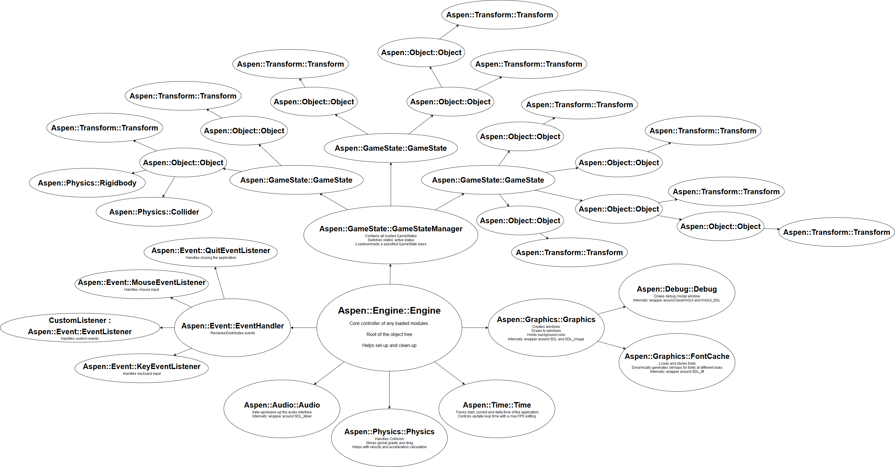

Tutorial
========

# Foreward: So you've decided to try Aspen {#foreward}

NOTE: Currently this tutorial is for Windows only. I'm sorry, but I haven't had time to port everything to Linux or macOS yet (and likely won't ever port it to macOS due to [Apple trying to push Metal so hard](https://arstechnica.com/gadgets/2018/06/the-end-of-opengl-support-other-updates-apple-didnt-share-at-the-keynote/)).

Aspen is a C++ game engine designed to make writing object-oriented code for games (and other software) easier. That being said, using it won't replace basic programming knowledge. The basics of C++ you should know before continuing are:

* How to compile "hello world" with g++ (Skip to [0.0. Installing MinGW](#installing-mingw) for now, then come back)
* [Basic data types](http://www.cplusplus.com/doc/tutorial/variables/#fundamental) (`char`, `short`, `int`, `float`, etc.)
* [Operators](http://www.cplusplus.com/doc/tutorial/operators/) and [Precedence](http://www.cplusplus.com/doc/tutorial/operators/#precedence)
* [Conditionals](http://www.cplusplus.com/doc/tutorial/control/#ifelse) and [Loops](http://www.cplusplus.com/doc/tutorial/control/#while) (`if`, `&&`, `||` `else`, `while`, and `for`)
* [Functions](http://www.cplusplus.com/doc/tutorial/functions/) (`void foo(int bar);`)
* [Pointers](http://www.cplusplus.com/doc/tutorial/pointers/) (`char foo;` vs `char * foo;` vs `char ** foo;` vs `char foo; &amp;foo;`)
* [Structs](http://www.cplusplus.com/doc/tutorial/structures/)
* [Enums](http://www.cplusplus.com/doc/tutorial/other_data_types/#enumerated_types)
* [Classes](http://www.cplusplus.com/doc/tutorial/classes/)
  * [Inheritence](http://www.cplusplus.com/doc/tutorial/inheritance/#inheritance)
  * public vs protected vs private
  * Constructors
* [Namespaces](https://www.geeksforgeeks.org/namespace-in-c/)
* (optional) What a [Format String Attack](https://www.owasp.org/index.php/Format_string_attack) is and how to prevent it.
* (optional) [Recursion](http://www.cplusplus.com/articles/D2N36Up4/)
* (optional) [Makefiles](https://www.cs.bu.edu/teaching/cpp/writing-makefiles/)

Make sure that you're comfortable (or at least know the name of so you can look it up later) everything in that list before moving on. If not, you'll likely run into a lot of issues that you won't be able to solve.

# 0. Compiling Aspen {#compiling}

Let's start by just compiling the engine/library. This will walk you through installing everything you need and setting up the necessary environment before compiling the actual library.

## 0.0. Installing MinGW {#installing-mingw}

If you haven't used MinGW (because you skipped here from the Foreward) yet or don't know what its name actually means, don't worry.

* MinGW stands for "Minimum GNU for Windows."

* GNU stand for "GNU's Not Unix."

* If that's confusing, don't worry about it too much.

MinGW is just a port of a bunch of software used to compile programs from Linux (more accurately, Unix) to Windows. To install it, just follow this list:

-# Go to [MinGW's website](http://www.mingw.org/).
-# Click "Download" in the list of tabs in top right.
-# Scroll down on this new page and click the (somewhat hidden) "Windows Download" button for `mingw-get-setup.exe`
-# Save the file when prompted and open it when it's finished downloading.
  -# Click "Install".
  -# Click "Continue".
  -# Once it's finished installing, click "Continue".
-# Once that install has completed, the "MinGW Installation Manager" will open.
  -# Click the white box next to "mingw32-base-bin" and select "Mark for Installation."
  -# Click the white box next to "mingw32-gcc-g++" and select "Mark for Installation."
  -# Click the white box next to "msys-base-bin" and select "Mark for Installation."
  -# In the top left, click "Installation," then "Apply changes."
  -# Click "Apply."
-# Once that completes, the GCC (GNU Compiler Collection) packages for `g++`, `make`, `gdb`, etc. will be installed. Now we have to tell Windows how to find them.
  -# Push the Windows key and type `path` and select "Edit the system environment variables."
  -# Click "Environment Variables" in the bottom right.
  -# Double click "Path" to edit it.
  -# Click "New" and enter `C:\MinGW\bin`
    * Change `C:` to another drive if you installed MinGW on a secondary drive.
    * Change `C:\MinGW\` if you installed MinGW to a custom path.
  -# Click "New" again and enter `C:\MinGW\msys\-#0\bin`
    * Change `C:` to another drive if you installed MinGW on a secondary drive.
    * Change `C:\MinGW\` if you installed MinGW to a custom path.
  -# Select one of the new entries and click "Move Up" until it's at the top. Do the same for the other entry.
  -# Click "OK" in all of the windows we just opened to save the changes.
-# That should be everything, so test your computer by opening a command window and running `g++`.
  -# Hold the Windows key and press R.
  -# Type `cmd` and push enter.
  -# Type `g++` and push enter.
  -# You should get a `fatal error: no input files` message.

## 0.1. Installing Visual Studio Code {#installing-vsc}

Really, you can use any text editor you like, I just prefer Visual Studio Code as it hooks into MinGW really easily. You can download and install it from [here](https://code.visualstudio.com/).

*Note:* Visual Studio Code may be refered to as VSCode, VS Code, VSC, or just Code in this tutorial.

## 0.2. Installing Git {#installing-git}

Git is a great source control option used by open-source developers the world over. As Aspen's source code is hosted on Github and it updates often, it's best to get it via a `git clone` rather than just downloading it once so we can update it easily. Git for Windows can be downloaded and installed from [here](https://gitforwindows.org/).

## 0.3. Downloading the SDL Development Libraries {#downloading-sdl}

Aspen uses SDL and a few of its extensions for graphics, audio, and fonts. Install them with these steps:

-# Download the SDL development libraries from [here](https://www.libsdl.org/release/SDL2-devel-2.0.9-mingw.tar.gz).
-# Download the SDL2_image development libraries from [here](https://www.libsdl.org/projects/SDL_image/release/SDL2_image-devel-2.0.4-mingw.tar.gz).
-# Download the SDL2_ttf development libraries from [here](https://www.libsdl.org/projects/SDL_ttf/release/SDL2_ttf-devel-2.0.15-mingw.tar.gz).
-# Download the SDL2_mixer development libraries from [here](https://www.libsdl.org/projects/SDL_mixer/release/SDL2_mixer-devel-2.0.4-mingw.tar.gz).
-# Windows doesn't have a way to unpack `.tar.gz` files by default, so install [7-zip](https://www.7-zip.org/), [WinRAR](https://www.rarlab.com/download.htm), or some other program that can (I prefer 7-zip).
-# Extract all 4 of those `.tar.gz` files into a new folder.
  * It should then contain `docs`, `i686-***`, `test`, and `x86_64-***`
-# Now we'll copy the correct files into where we installed MinGW.
  * If you are running a 64-bit version of Windows, open `i686-w64-mingw32` and copy everything into `C:\MinGW\`.
    * Change `C:` to another drive if you installed MinGW on a secondary drive.
    * Change `C:\MinGW\` if you installed MinGW to a custom path.
  * If you are running a 32-bit version of Windows, open `x86_64-w64-mingw32` and copy everything into `C:\MinGW\`.
    * Change `C:` to another drive if you installed MinGW on a secondary drive.
    * Change `C:\MinGW\` if you installed MinGW to a custom path.
  * If you are unsure what version of Windows you're running, try the 64-bit version first, then if it doesn't work, try the 32-bit version instead.

## 0.4. Downloading Aspen {#downloading-aspen}

Now let's finally download Aspen!

-# Open a new command window (Windows+R, `cmd`) and navigate to the folder you want to work within with `cd FOLDERNAME`.
  * For example, if you're going to be working in `C:\Users\YOURNAME\Documents`, just type `cd Documents` and push enter.
-# Type `git clone https://github.com/BtheDestroyer/Aspen --recurse-submodules` to download Aspen and it's submodules (other projects it uses) into `CURRENTFOLDER\Aspen`.
-# Type `cd Aspen` to enter the newly downloaded folder.
-# Type `make project` to try building the example project.
-# If you got no errors, you should now have a `build` folder in Aspen's folder.
  -# If you got errors about SDL, redo [0.3](#downloading-sdl).
  -# If you got errors about imgui or imgui_sdl, delete the `Aspen` folder you created and reclone the project with `--recurse-submodules`.
-# This will contain a file called `aspen.exe` which you can run to see the example project.
  -# If you get an error with the title "aspen.exe - Entry Point Not Found", go back to the folder from [0.3](#downloading-sdl) that you copied into your MinGW instalation (either `i686-***` or `x86_64-***`) and open the `bin` folder.
  -# Copy all of the `.dll` files into `Aspen\build`.
    * The ones I've found 
  -# Try running `aspen.exe` again.

Congratulations! You can now build your own Aspen project by replacing `Aspen\src\main.cpp` with whatever code you want!

# 1. Aspen's "Hello World" {#hello-world}

## 1.1. Creating a Window {#hello-window}

Let's start by first emptying `main.cpp`. Open VS Code and click and drag the entire `Aspen` folder into it. It should refresh itself with a new display on the left listing all of the folders and their files that you have access to. Open `src` and then double click `main.cpp` to open it. You may get a notification in the bottom right about a "C++ extension" you can install - you should install it now, then click the "two papers" icon in the top left to switch back to the folder view.

Now that `main.cpp` is open, push Ctrl+A to select everything and push backspace to delete it.

What you should know by now is that every program needs a `main` function, so let's make one:

~~~~~~~~~~~~~{.cpp}
// If you don't know why there's argc and argv here, don't worry about it
int main(int argc, char **argv)
{

    return 0;
}
~~~~~~~~~~~~~

The first thing we want to do is start up Aspen's Engine. Go ahead and add the following `include` and code:

~~~~~~~~~~~~~{.cpp}
#include "Engine.hpp"

int main(int argc, char **argv)
{
    // START_FLAGS::ALL tells the Engine object to initialize all of its built-in modules
    Aspen::Engine::Engine engine(Aspen::Engine::START_FLAGS::ALL);
    return 0;
}
~~~~~~~~~~~~~

Finally, we have to have some kind of loop to keep our game from closing immediately:

~~~~~~~~~~~~~{.cpp}
#include "Engine.hpp"

int main(int argc, char **argv)
{
    Aspen::Engine::Engine engine(Aspen::Engine::START_FLAGS::ALL);
    while (engine) // While the engine is valid and active...
        engine();  // Continue running it
    return 0;
}
~~~~~~~~~~~~~

Now open a terminal from within VS Code with Ctrl+\` and type `make run` to build and run your project. This should create a graphics window with an "Object Tree" subwindow and output a bunch of information to the terminal.

## 1.1. Creating a GameState {#hello-gamestate}

Aspen uses GameStates to differentiate between different... game states.

* If you're coming from Unity, think of them like different Scenes.
* If you're coming from Clickteam Fusion, think of them like different Frames.

In order to create our own GameState, we can make a new `class` that inherits `Aspen::GameState::GameState`

~~~~~~~~~~~~~{.cpp}
// main.cpp

// other includes...

#include "GameState.hpp"
#include <string>

class MyState : public Aspen::GameState::GameState
{
public:
    // Any Object in Aspen needs to take a parent pointer and name, then pass it to its base class
    MyState(Aspen::Object::Object *parent = nullptr, std::string name = "My State")
      : Aspen::GameState::GameState(parent, name)
    {
        // TODO
    }
};

// other code
~~~~~~~~~~~~~

Now we can create *other* objects within our state's constructor. Let's start with something basic - a black square. I'll split this up over multiple lines so each step can be commented

~~~~~~~~~~~~~{.cpp}
// main.cpp

// includes
#include "Graphics.hpp"

class MyState : public Aspen::GameState::GameState
{
public:
    MyState(Aspen::Object::Object *parent = nullptr, std::string name = "My State")
      : Aspen::GameState::GameState(parent, name)
    {
        // Create a new child
        AddChild(
            // The child is a new rectangle
            new Aspen::Graphics::Rectangle(
                // x = 0, y = 0, width = 32, height = 32
                SDL_Rect({0, 0, 32, 32}),
                // It's black and filled
                Aspen::Graphics::Colors::BLACK, true,
                // this is its parent and its name is "Rectangle" (this can be omitted)
                this, "Rectangle"
                )
            );
    }
};

// other code
~~~~~~~~~~~~~

Now we just have to add our GameState to the list of states within the Engine. We can do this by adding it to the GameStateManager. Again, this is split across multiple lines for commenting

~~~~~~~~~~~~~{.cpp}
// main.cpp

// includes

// our class

int main(int argc, char **argv)
{
    Aspen::Engine::Engine engine(Aspen::Engine::START_FLAGS::ALL);

    // Find the GameStateManager from the list of immediate children of the Engine (ie: its core modules)
    engine.FindChildOfType<Aspen::GameState::GameStateManager>()
        // Then load a state of the type MyState
        ->LoadState<MyState>
        // Activate it when it's loaded
            (true);

    while (engine)
        engine();
    return 0;
}
~~~~~~~~~~~~~

We'll get back to the ideas of GameStates and the GameStateManager later. For now, go ahead and `make run` again to build and run your project and there should be a black square in the top left (0, 0).

## 1.2. The Debugger {#hello-debugger}

Now time to talk about that "Object Tree" submenu. It's actually the Aspen::Debug::Debug object (which is really just a nice wrapper around imgui).

Click on the different objects in the tree to view their children and try to find the rectangle we made. By default, most objects have a Aspen::Transform::Transform child which allows you to get and set their position, rotation, and scale. Try messing with these values within the debugger to see how they affect your Rectangle.

You can also view certain uneditable properties of objects. This will be useful when trying to actually debug certain objects that may not behave as you intended (such as animations not containing the correct number of frames).

## 1.3. Logs {#hello-logs}

Speaking of debugging, let's try debug printing to get some information to the terminal. Aspen has its own wrapper around the normal C++ printing methods in the namespace Aspen::Log. We can call them like this:

~~~~~~~~~~~~~{.cpp}
// ... code ...

// [####] is the current line number
Aspen::Log::Debug("Hello"); // Prints "[####] DBG: Hello"
Aspen::Log::Info("Hello"); // Prints "[####] INF: Hello"
Aspen::Log::Warning("Hello"); // Prints "[####] WAR: Hello"
Aspen::Log::Error("Hello"); // Prints "[####] ERR: Hello"

// ... code ...
~~~~~~~~~~~~~

If you want to disable printing certain levels of messages, you can use `Log.TogglePrint()`:

~~~~~~~~~~~~~{.cpp}
Aspen::Log::Debug("Hello"); // Prints "[####] DBG: Hello"
Aspen::Log::Info("World"); // Prints "[####] INF: World"

Aspen::Log::Debug.TogglePrint(); // Toggles Debug off

Aspen::Log::Debug("Hello"); // Doesn't print
Aspen::Log::Info("World"); // Prints "[####] INF: World"
~~~~~~~~~~~~~

We can also set an output file with the following line. It's recommended to do this as the first thing in main before you create the Engine so you can also log any information from that to the file:

~~~~~~~~~~~~~{.cpp}
Aspen::Log::Log::SetFile("./Aspen.log");

// ... code ...
~~~~~~~~~~~~~

Finally, we can create our *own* log objects as well:

~~~~~~~~~~~~~{.cpp}
//                    message prefix      message suffix
Aspen::Log::Log MyLog("My own log: ", " That's all, folks!");

MyLog("Hello world!"); // Prints "[####] My own log: Hello world! That's all, folks!"
~~~~~~~~~~~~~

## 1.4. Custom Objects and Events {#hello-objects}

Now we have a Rectangle in our GameState so we can try moving it. One method of doing that is by controlling it from within the state using the [OnUpdate](https://bthedestroyer.github.io/Aspen/class_aspen_1_1_object_1_1_object.html#a34a8edeee9c0fdb461dfcdfbec4e2892) method:

~~~~~~~~~~~~~{.cpp}
// main.cpp

// includes

class MyState : public Aspen::GameState::GameState
{
  Aspen::Graphics::Rectangle *rectangle;

public:
    MyState(Aspen::Object::Object *parent = nullptr, std::string name = "My State")
      : Aspen::GameState::GameState(parent, name)
    {
        rectangle = new Aspen::Graphics::Rectangle(SDL_Rect({0, 0, 32, 32}), Aspen::Graphics::Colors::BLACK, true, this, "Rectangle");
        AddChild(rectangle);
    }

    void OnUpdate()
    {
      // This will add 1 to the rectangle's x position every frame
      rectangle->GetTransform()->ModifyXPosition(1);
    }
};

// main function
~~~~~~~~~~~~~

This *will* work, but causes problems in the future. For example, what if we later make multiple states/levels that all have the same player character in them? We'd have to copy-paste a whole lot of code for moving that player around and determining how it interacts with everything else. So instead of writing everything within our GameState, we can create a new type of Object by inheriting any Object class into our own.

~~~~~~~~~~~~~{.cpp}
// main.cpp

// includes

class MyObject : Aspen::Graphics::Rectangle
{
public:
    MyObject(Aspen::Object::Object *parent = nullptr, std::string name = "My State")
      : Aspen::Graphics::Rectangle(SDL_Rect({0, 0, 32, 32}), Aspen::Graphics::Colors::BLACK, true, parent, name)
    {
    }
    
    void OnUpdate()
    {
      // Now that our object is updating itself rather than being controlled externally
      // we don't have to write "rectangle->" at the start of this line
      GetTransform()->ModifyXPosition(1);
    }
};

class MyState : public Aspen::GameState::GameState
{
public:
    MyState(Aspen::Object::Object *parent = nullptr, std::string name = "My State")
      : Aspen::GameState::GameState(parent, name)
    {
        AddChild(new MyObject());
        // Since our object doesn't have any required parameters, you can also use this line:
        // CreateChild<MyObject>()
    }
};

// main function
~~~~~~~~~~~~~

One important note is that if you try to get a child of an object that doesn't exist, the request function (such as `GetTransform()`) will return `nullptr` (`0x0`). While most Objects create their own Transform, the base Aspen::Object::Object *does not*. If you're creating more abstract "Container Objects" by inheriting Aspen::Object::Object, make sure you use `CreateChild<Aspen::Transform::Transform>()` within its constructor so future `GetTransform()` calls don't cause a crash.

## 1.5. Input {#hello-input}

Rather than just moving objects in one direction, let's take input from the user to control our object.

**Note:** Most forms of input require certain "event listeners" to exist and store input. This isn't an issue if you're still using `Aspen::Engine::START_FLAGS::ALL` when you create the Engine as they're automatically created for you.

~~~~~~~~~~~~~{.cpp}
// main.cpp

// includes
#include "Input.hpp"

class MyObject : Aspen::Graphics::Rectangle
{
public:
    // Constructor

    void OnUpdate()
    {
      // Aspen uses SDL's events for keyboard input, so we use their SDLK names
      if (Aspen::Input::KeyHeld(SDLK_w))
        // In 2D graphics, (0, 0) is the top left of the window which is vertically flipped from standard 2D graphs
        // This means -y is actually up
        GetTransform()->ModifyYPosition(-1);
      if (Aspen::Input::KeyHeld(SDLK_a))
        GetTransform()->ModifyXPosition(-1);
      if (Aspen::Input::KeyHeld(SDLK_s))
        GetTransform()->ModifyYPosition(1);
      if (Aspen::Input::KeyHeld(SDLK_d))
        GetTransform()->ModifyXPosition(1);
    }
};

// GameState class

// main function
~~~~~~~~~~~~~

The above code will move any `MyObject` class using WASD input by utilizing the `Aspen::Input::KeyHeld` function which returns `true` so long as the given key is held. There are also `KeyPressed` and `KeyReleased` functions which return `true` on the first frame and after the last frame a key is pressed respectively.

For mouse input, there's a little more work we have to do. First, we have to get a reference to the global `Aspen::Input::Mouse` object with `Aspen::Input::GetMouse()`. From there, we can get data from the mouse:

| Property | Description |
|----------|-------------|
| .x | World X position of the cursor |
| .y | World Y position of the cursor |
| .dx | Horizontal distacne the cursor moved since last frame |
| .dy | Vertical distacne the cursor moved since last frame |
| .wheel | Amount the mouse wheel was scrolled since last frame (positive, negative, or zero) |
| .left | "Key" containing a `.held`, `.pressed`, and `.released` for the left mouse button |
| .right | "Key" containing a `.held`, `.pressed`, and `.released` for the right mouse button |
| .middle | "Key" containing a `.held`, `.pressed`, and `.released` for the middle mouse button |

You can use these properties to take mouse input and act off of it. For example, you can use `Aspen::Input::GetMouse().left.held` to determine if the left mouse button is being held or `Aspen::Input::GetMouse().wheel` to determine if the mouse wheel is being scrolled up or down.

## 1.6. The Architecture of Aspen {#hello-architecture}

Don't get intimidated by this image! Let's break things down a bit:

### Why and how?

Everything you see in this tree is in *some way* an Object (Aspen::Object::Object) through inheritence. The idea here is that Objects have a list of children (internally, std::vector<Aspen::Object::Object *>) and a parent (internally, Aspen::Object::Object *) to organize and order execution of their code. This can be a little confusing, but it can also be extremely useful. For example, we've been creating Objects using dynamic memory allocation through `new`, but we never have to free them with `delete` because they are freed by their parent automatically. It also means we can use special methods that are automatically run like `OnUpdate`, `OnCollision`, `OnMouseClick`, etc. We can also go up the tree with methods like `Parent()` and `FindAncestorOfType<CLASS>()`; we can go down the tree with methods like `Children()`, `FindChildOfType<CLASS>()`, and `FindDescendentOfType<CLASS>()`.

There are a few non-Object classes in Aspen, though they act statically (eg: Aspen::Log::Log).

### Engine and Modules

The core of the Aspen engine is... the Engine class! It doesn't do much on its own, but it does have some advantages over a regular Object.

* It has ways to automatically set up *all* of the built-in objects (that's what the START_FLAGS are for).
* Rather than going all the way up the tree every time we want to find it, we can instead use `Aspen::Engine::Engine::Get()` to immediately get the core Engine.
  * This is useful if you need to access any of the core modules.

I've used the term "module" a few times. What that term means is "any object that's a direct child of Engine." The intention is that modules allow Aspen to be... well, modular; to allow custom "plugin" modules to act as extensions if certain functionality doesn't exist in the core engine or even replacing the default, say, Physics module with your own custom implementation.

### EventHandler

This distributes events from the system (and potentially other Objects) to the appropriate EventListener. Built-in Listeners include those for tracking keyboard and mouse input.

### Audio

Handles audio like sound effects and music.

### Physics

Assists in physics calculation and collision detection/resolution.

### Time

Tracks time properties (like `DeltaTime()`) and limits the framerate if requested.

### Graphics

Creates and handles windows. Contains Debug for viewing the Object-tree in-application and the FontCache for loading/storing ttf fonts.

### GameStateManager

This is the big one. This contains different GameStates classes that have been loaded which contain different Objects. Objects can also have children which inherit their parent's transformation properties.

## 1.7. Multi-File Aspen Projects {#hello-multi-file}

Programming is way faster if projects are split across multiple files rather than all in one big `main.cpp`. For one, you can organize your code so that you're not scrolling through thousands of lines every time you're looking for one function; and two, `make` only has to compile files that have been modified rather than the entire project.

-# Make a new folder with nothing in it in Documents (*NOT IN ASPEN'S FOLDER*) called "FirstAspenProject".

-# Now inside of that folder, let's make folders called "src", "inc", "libraries", and "resources".

-# Now make a new file called "Makefile". *Note:* make sure it doesn't have the `.txt` extension. Windows hides this by default, so if you don't see file extensions like `.txt`, `.png`, `.docx`, etc. on your computer, click "View" at the top of your file explorer and then make sure "File name extensions" is checked.

-# Now copy your `main.cpp` from the old "src" into the new "src".

-# Copy `libAspen.a` and `libimgui.a` from your old "build" folder into the new "libraries" folder.

-# Copy the old "inc" folder into the new "libraries" folder.

This should now be your new folder's struture:

~~~~~~~~~~~~~~~~~~~
FirstAspenProject
│   Makefile
│
├───inc
├───libraries
│   │   libAspen.a
│   │   libimgui.a
│   │
│   └───inc
│       │   Audio.hpp
│       │   ****.hpp
│       │   Version.hpp
│       │
│       └───SDL2
│               ***.h
│
├───resources
└───src
        main.cpp
~~~~~~~~~~~~~~~~~~~

Now let's edit that Makefile so `make` can build our project correctly. For now, just use this one:

~~~~~~~~~~~~~~~~~~~~~{Makefile}
# Set up some variables
SOURCES := ./src
HEADERS := ./inc
BUILD := ./build
OBJECTS := $(BUILD)/obj
# Rename aspen.exe if you want
OUTPUT := $(BUILD)/aspen.exe
PLATFORM :=__WIN32

CXX := g++.exe
CXXFLAGS := -g -I$(HEADERS) \
			-Ilibraries/inc \
			-Wall -Wextra -Wno-unused-parameter \
			-std=c++14 \
			-D$(PLATFORM) \
			-mwindows -Dmain=SDL_main
LINKFLAGS :=-LC:/MinGW/lib -L./libraries\
            -lAspen \
			-lmingw32 \
			-limgui \
			-lSDL2main -lSDL2 \
			-lSDL2_image -lSDL2_ttf -lSDL2_mixer \
			-static-libstdc++ \
            -mwindows
ifdef RELEASE
CXXFLAGS += -O2
else
CXXFLAGS += -D__DEBUG -mconsole
LINKFLAGS += -mconsole
endif

# Find all source files
CPPFILES := $(wildcard $(SOURCES)/*.cpp)
HPPFILES := $(wildcard $(HEADERS)/*.hpp) $(wildcard $(HEADERS)/*.h)
OBJFILES := $(patsubst $(SOURCES)/%.cpp, $(OBJECTS)/%.o,$(CPPFILES))

#################################

# Default build
.PHONY: project
project: $(OUTPUT)
	@echo Built: $(OUTPUT)

# Builds the executable
$(OUTPUT): $(OBJFILES)
	$(CXX) $(OBJFILES) $(LINKFLAGS) -o $(OUTPUT)
	cp C:/MinGW/bin/SDL2.dll $(BUILD)
	cp C:/MinGW/bin/SDL2_image.dll $(BUILD)
	cp C:/MinGW/bin/SDL2_mixer.dll $(BUILD)
	cp C:/MinGW/bin/SDL2_ttf.dll $(BUILD)
  cp resources $(BUilD)

# Compiles all cpp source files
$(OBJECTS)/%.o: $(SOURCES)/%.cpp
	$(CXX) -c $(CXXFLAGS) $< -o $@
  
# Auto generates required folder
$(OBJFILES) : | $(OBJECTS)

# Auto generates required folder
$(OBJECTS): | $(BUILD)
	@mkdir -p $@

# Auto generates required folder
$(BUILD):
	@mkdir -p $@
  
# Helps with clean up
.PHONY: clean
clean:
	rm -rf $(BUILD)

# Helps with running
.PHONY: run
run: $(OUTPUT)
	$(OUTPUT)
~~~~~~~~~~~~~~~~~~~~~

With that out of the way, let's try to run `make run` in our new folder. It should compile and run our project just like before. If not, make sure you copied all of the files and the `Makefile` source correctly.

With this new setup, we can treat Aspen as any other precompiled library rather than working within the limitations of its example `Makefile`. We can now create as many header and source files we want within "inc" and "src" respectively and use them like any other multi-file C++ project.

# 2. Drawing Images {#images}

There are a few types of ways we can draw images. Static/unchanging images are called Sprites while images that change from frame to frame are called Animations.

## 2.1. Static Images {#images-static}

To make a Sprite, we'll need an image. If you don't have one, you can use [Aspen's logo](https://github.com/BtheDestroyer/Aspen/blob/master/Aspen_Logo.256.png) for now. Make sure whatever image you use is located in "resources" and that it's either a `.png` or `.bmp`. Currently Aspen does *not* have jpg support.

~~~~~~~~~~~~~{.cpp}
// main.cpp

// includes

// object class

class MyState : public Aspen::GameState::GameState
{
public:
    MyState(Aspen::Object::Object *parent = nullptr, std::string name = "My State")
      : Aspen::GameState::GameState(parent, name)
    {
        // Create a new Sprite
        Aspen::Graphics::Sprite *sprite = new Aspen::Graphics::Sprite(
          // First parameter is the path
          "./resources/aspen.png",
          // Final parameters are standard and optional
          this, "Aspen Icon");
        // Center the image
        sprite->GetTransform()->SetPosition(Aspen::Graphics::DEFAULT_WINDOW_WIDTH / 2, Aspen::Graphics::DEFAULT_WINDOW_HEIGHT / 2)
        // Add the sprite as a child of the state
        AddChild(sprite);
    }
};

// main function
~~~~~~~~~~~~~

This should create your image in the center of the window.

## 2.2. Animations {#images-animations}

Animations are a little trickier as the have to take another Object as a parameter called a Spritesheet. Currently, there's only the UniformSpritesheet, so use that.

If you don't have a spritesheet file to test with or don't know what "uniform" means in that context, take a look at these ones by @ScissorMarks: https://arks.itch.io/dino-characters

The "Uniform" of UniformSpritesheet just means every frame of an animation is equally sized and directly next to each other in a grid. Frames of animation may be split across multiple lines, so long as the line break is at the horizontal end of the image (not randomly in the middle of it). You can only have one animation per file with UniformSpritesheets, so if you download one with multiple animations, make sure you split it up.

The below code should create an Animation at the center of your window. If your program crashes or nothing shows up, make sure you have your files named correctly and are inputting the correct frame sizes and count.

~~~~~~~~~~~~~{.cpp}
// main.cpp

// includes

// object class

class MyState : public Aspen::GameState::GameState
{
public:
    MyState(Aspen::Object::Object *parent = nullptr, std::string name = "My State")
      : Aspen::GameState::GameState(parent, name)
    {
        // Create a new Spritesheet
        Aspen::Graphics::UniformSpritesheet *sheet = new Aspen::Graphics::UniformSpritesheet(
          // First parameter is the path
          "./resources/dino - walk.png",
          // Then the size of each frame
          24, 24,
          // Now the number of frames
          7,
          // Final parameters are standard and optional
          nullptr, "Dino Walk Sheet");

        // Create a new Animation
        Aspen::Graphics::Animation *anim = new Aspen::Graphics::Animation(
          // First parameter is the Spritesheet
          sheet,
          // Then enter the number of seconds each frame should be displayed
          // You can enter "1.0f / FPS" to convert frames per second into seconds per frame
          1.0f / 12.0f,
          // Final parameters are standard and optional
          this, "Dino Walk Animation");
        // Center the image
        anim->GetTransform()->SetPosition(Aspen::Graphics::DEFAULT_WINDOW_WIDTH / 2, Aspen::Graphics::DEFAULT_WINDOW_HEIGHT / 2)
        // Add the sprite as a child of the state
        AddChild(anim);
    }
};

// main function
~~~~~~~~~~~~~

If you want to check when an Animation loops (making sure it only runs a certain number of times, for example), then you can use its `Done()` method which is true for 1 update cycle after an Animation loops.

## 2.3. Custom Window Size {#images-window}

*TODO*

# 3. Physics {#physics}

*TODO*

## 3.1. The Rigidbody {#physics-rigidbody}

*TODO*

## 3.2. Circle Colliders {#physics-circle}

*TODO*

## 3.3. Box/AABB Colliders {#physics-aabb}

*TODO*

## 3.4. Collision Events {#physics-aabb}

*TODO*

# 4. Audio {#audio}

*TODO*

## 4.1. Sound Effects {#audio-sfx}

*TODO*

## 4.2. Music {#audio-music}

*TODO*

# 5. Game State Manager {#state-manager}

*TODO*

## 5.1. Loading multiple states {#state-load}

*TODO*

## 5.2. Swapping States {#state-swap}

*TODO*

## 5.3. Reloading States {#state-reload}

*TODO*

# 6. Event Manager {#event-manager}

*TODO*

## 6.1. Custom Events {#event-custom}

*TODO*
